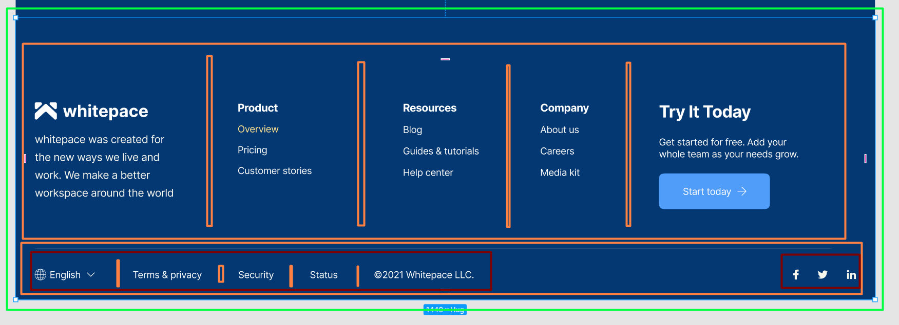

# Steps

1. figma failas https://www.figma.com/community/file/1156860863353724933
2. Footer
   

3.

## Css selector simbols

1. '.' - klase
2. '#' - id
3. h1 - tagas
4. ' ' - einam i elemento vidu. ieskom kaireje tarpo puseje esancio element viduje, desineje tarpo puseje esansio elemento. 'h1 span' - ieskom h1 vidje esancio span
5. .btn.btn-main - taikom i elementa turinti 2 klases

```html
<button class="btn btn-main">Try TasKey Free</button> - pataikysim
<button class="btn btn-green">Try TasKey Free</button> - nepataikysim
<button class="btn">Try TasKey Free</button> - nepataikysim
```

6. .btn .btn-main - taikom i elementa turinti 2 klases

```html
<div class="btn">
  <button class="btn-main">Pataikysim</button>
  <a class="btn-main">Pataikysim</a>
  <p class="btn-main">Pataikysim </p>
</div>
<button class="btn btn-main">Try TasKey Free</button> - nepataikysim
<button class="btn btn-green">Try TasKey Free</button> - nepataikysim
<button class="btn">Try TasKey Free</button> - nepataikysim
```

7. '\*' - universalus selectorius
   .aside \*

8. '>' - tiesioginis vaikinis elementas
   .blue > \* - h2 ir div.in
   .blue > div - .blue elemento viduje esantys tiesioginiai vaikai divai

```html
<div class="blue">
  <h2 class="green">asd</h2>
  <div class="in">
    <h3 class="h">asd</h3>
  </div>
</div>
```
